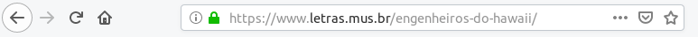

# Web Scraping com Beaultifulsoap
Raspando o site letras.com.br em busca de letras musicais.
-----
### O que é
Este script captura todas os links de uma banda, grupo ou artista a partir da página www.letras.mus.com.br/ e, em seguida, acessa cada um dos links capturando todas as letras das músicas. O tratamento das letras e feito com o método "punctuation" que remove todos os caracteres especiais do texto, daí, usando NLTK, este script remove todas as stopwords e retorna uma string contida de todas as palavras restantes que são, por fim, gravados como um arquivo de texto plano no disco.
### Finalidade
Com este script é possível capturar grande massa de palavras a fim de trabalhar com análise de sentimentos ou simplesmente criar uma nuvem de tags.
### Como usar
Clone, copie e cole ou faça download do arquivo web-scraping-beautifulsoap.py, em seguida digite em um Terminal **python3 web-scraping-beautifulsoap.py [nome da banda ou grupo músical]**. Veja os exemplos a seguir:

```bash
# exemplo para capturar todas as letras da banda Skank
python3 web-scraping-beautifulsoap.py skank

# exemplo para capturar todas as letras da banda Pato-Fu e exibir como preview 
# os 250 primeiros caracteres
python3 web-scraping-beautifulsoap.py pato-fu 250
```
Como rusultado disso, você terá um arquivo em texto limpo pronto para sua análise de sentimentos.
Se acaso você ficar na dúvida de como formar o argumento da linha de comando, ou seja, como escrever o nome de sua banda ou grupo musical predileto, basta ir ao site www.letras.com.br e entrar no *profile* da sua banda ou grupo musical predileto.
<br><br>
Copie apenas o nome e cole no Terminal junto do restante do código e pressione ENTER para confirmar. O processo de raspagem pode demorar um pouco a depender da sua velocidade de conexão com a internet. 
